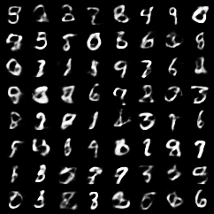
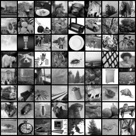
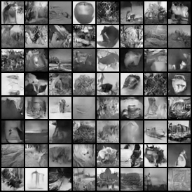

**Pre-trained GANs, VAEs + classifiers for MNIST / CIFAR10**

- includes model class definitions + training scripts
- includes notebooks showing how to load pretrained nets / use them
- tested with pytorch 1.0, python 3
- generates images the same size as the dataset images
- based on the official [pytorch examples repo](https://github.com/pytorch/examples/tree/master/dcgan) with modifications to generate the appropriate size

### mnist

Generates images the size of the MNIST dataset (28x28), using an architecture based on the [DCGAN paper](http://arxiv.org/abs/1511.06434). Trained for 100 epochs. Weights [here](https://github.com/csinva/pytorch_gan_pretrained/tree/master/mnist_dcgan/weights).

| data samples                                                |  dcgan samples                                       |    vae samples                                      |
| ------------------------------------------------------------ | ------------------------------------------------------------ | ---------------------------------------------------- |
|   |  |  | 

For comparison with a less complicated architecture, I've also included a pre-trained non-convolutional GAN  in the [mnist_gan_mlp](mnist_mlp) folder, based on code from [this repo](https://github.com/BeierZhu/GAN-MNIST-Pytorch/blob/master/main.py) (trained for 300 epochs).

I've also included a pre-trained LeNet classifier which achieves 99% test accuracy in the [mnist_classifier](mnist_classifier) folder, based on [this repo](https://github.com/activatedgeek/LeNet-5).

### cifar10

The cifar10 gan is from the [pytorch examples repo](https://github.com/pytorch/examples/tree/master/dcgan) and implements the [DCGAN paper](http://arxiv.org/abs/1511.06434). It required only minor alterations to generate images the size of the cifar10 dataset (32x32x3). Trained for 200 epochs. Weights [here](https://github.com/csinva/pytorch_gan_pretrained/tree/master/cifar10_dcgan/weights).

| data samples                                            |    generated samples                                        |
| ------------------------------------------------------------ | ------------------------------------------------------ |
|  |   |

I've also linked to a pre-trained cifar10 classifier in the [cifar10_classifier](cifar10_classifier) folder from [this repo](https://github.com/aaron-xichen/pytorch-playground/tree/master/cifar).

### cifar100

Similiar to the above gans, the cifar100 gan here generates 32x32x1 images for generating grayscale images. Trained for 200 epochs. Weights [here](https://github.com/csinva/pytorch_gan_pretrained/tree/master/cifar100_dcgan_grayscale/weights). There are also weights/code for generating images which are 34x45x1.

| data samples                                             |   generated samples                                        |
| ------------------------------------------------------------ | ------------------------------------------------------ |
|  |  |

### reference

- feel free to use/share this code openly
- for similar projects, see related repos: (e.g. [interpretability implementations](https://github.com/csinva/interpretability-implementations-demos), [acd](https://github.com/csinva/acd)) or my website ([csinva.github.io](https://csinva.github.io/))
- tweets [@chandan_singh96](https://twitter.com/chandan_singh96)

