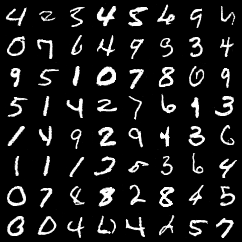
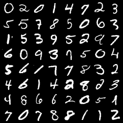

**Pre-trained GANs for MNIST / CIFAR10**

- includes model class definitions + training scripts
- includes notebooks showing how to load pretrained nets / use them
- tested with pytorch 1.0, python 3
- generates images the same size as the dataset images
- based on the official [pytorch examples repo](https://github.com/pytorch/examples/tree/master/dcgan) with modifications to generate the appropriate size

### mnist

Generates images the size of the MNIST dataset (28x28), using an architecture based on the [DCGAN paper](http://arxiv.org/abs/1511.06434). Trained for 100 epochs. Weights [here](https://github.com/csinva/pytorch_gan_pretrained/tree/master/mnist_dcgan/weights).

| generated samples                                            | data samples                                         |
| ------------------------------------------------------------ | ---------------------------------------------------- |
|  |  |

For comparison with a less complicated architecture, I've also included a pre-trained non-convolutional GAN  in the [mnist_mlp](mnist_mlp) folder, based on code from [this repo](https://github.com/BeierZhu/GAN-MNIST-Pytorch/blob/master/main.py) (trained for 300 epochs).

### cifar10

The cifar10 gan is from the [pytorch examples repo](https://github.com/pytorch/examples/tree/master/dcgan) and implements the [DCGAN paper](http://arxiv.org/abs/1511.06434). It required only minor alterations to generate images the size of the cifar10 dataset (32x32x3). Trained for 200 epochs. Weights [here](https://github.com/csinva/pytorch_gan_pretrained/tree/master/cifar10_dcgan/weights).

| generated samples                                            | data samples                                           |
| ------------------------------------------------------------ | ------------------------------------------------------ |
|  |  |

### reference

- feel free to use/share this code openly
- for similar projects, see some of my other repos: (e.g. [acd](https://github.com/csinva/acd)) or my website ([csinva.github.io](https://csinva.github.io/))